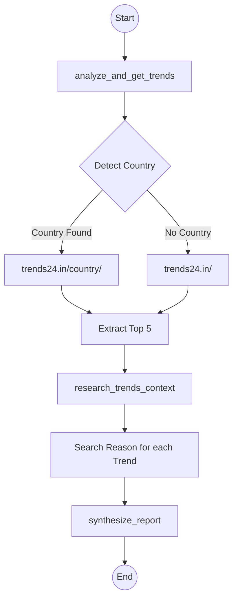

# X Trends Agent - Built with LangGraph

## Introduction

The X Trends Agent is an AI-powered conversational system designed to analyze trending topics on X (formerly Twitter). Built using **LangGraph** for orchestration and the **Agent Stack SDK**, it specializes in identifying trending topics by country, researching the context behind each trend, and providing friendly, engaging summaries with emojis and source citations.

The agent is designed to run entirely locally using **Ollama** and the **IBM Granite 4** model.

## Agent Workflow (LangGraph)

Below is the visual representation of the agent's logic flow orchestrated by LangGraph:



## Requirements

### Minimum Requirements

- **Python:** Version 3.11 or higher.
- **Dependency Management:** `uv` is recommended for managing Python packages.
- **Ollama:** Required for running the local LLM (`granite4:tiny-h`).

### Python Dependencies

Main packages used:
- `langchain` & `langgraph`: For orchestrating the agent's reasoning flow.
- `langchain-ollama`: To interact with the local LLM.
- `agentstack-sdk`: For A2A protocol and server management.
- `ddgs`: Web search via DuckDuckGo.

## Installation

1.  **Clone the repository:**
    ```bash
    git clone <repository-url>
    cd x_trends_agent
    ```

2.  **Install dependencies:**
    ```bash
    uv sync
    ```

3.  **Install Ollama and the model:**
    ```bash
    # Pull the required model
    ollama pull granite4:tiny-h
    ```

## Running the Agent

1.  **Start the agent:**
    ```bash
    uv run server
    ```
    The agent will start and be ready on `http://127.0.0.1:8002` (configurable via `PORT` env var).

## How It Works

The agent uses a **StateGraph (LangGraph)** to process queries through a dynamic pipeline:

1. **Country Detection:** Uses the LLM to identify if the user is asking about a specific region.
2. **Trend Retrieval:** Scrapes `trends24.in` specifically for the target country (or global) to get the top 5 trending topics.
3. **Context Research:** For each of the top 5 trends, it performs targeted web searches to find the "why" behind the trend.
4. **Friendly Synthesis:** Generates a coherent report with emojis (💡, 📰, 🚀) and, most importantly, **includes the source URLs** of the news found.

## Usage Examples

- *"What's trending in Mexico?"*
- *"Show me global trends on X today"*
- *"What's happening in Spain?"*

## Project Structure

- `src/beeai_agents/agent.py`: Main logic of the agent, including the LangGraph definition and A2A server.
- `pyproject.toml`: Dependency and script definitions.

## Disclaimer

This agent is built for demonstration purposes. Ensure you have Ollama running locally for the LLM to function properly.